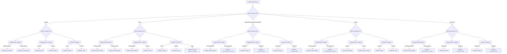

# La concordancia de tiempos

```mermaid
graph TD
    A[Главное предложение] --> B{Время главного глагола}
    B -->|Presente| C1{Действие придаточного}
    B -->|Futuro| C2{Действие придаточного}
    B -->|Indefinido/Imperfecto/Pluscuamperfecto| D{Действие придаточного}
    B -->|Perfecto| K{Действие придаточного}
    B -->|Condicional| O{Действие придаточного}
    
    C1 --> E1[Предшествует главному]
    C1 --> F1[Одновременно с главным]
    C1 --> G1[Следует за главным]
    
    C2 --> E2[Предшествует главному]
    C2 --> F2[Одновременно с главным]
    C2 --> G2[Следует за главным]

    E1 --> |Pretérito Perfecto| E11[Indicativo: Ha cantado]
    E1 --> |Pretérito Perfecto| E12[Subjuntivo: Haya cantado]
    
    F1 --> |Presente| F11[Indicativo: Canta]
    F1 --> |Presente| F12[Subjuntivo: Cante]
    
    G1 --> |Futuro| G11[Indicativo: Cantará]
    G1 --> |Presente| G12[Subjuntivo: Cante]
    
    E2 --> |Pretérito Perfecto| E21[Indicativo: Habrá cantado]
    E2 --> |Pretérito Perfecto| E22[Subjuntivo: Haya cantado]
    
    F2 --> |Presente/Futuro| F21[Indicativo: Canta/Cantará]
    F2 --> |Presente| F22[Subjuntivo: Cante]
    
    G2 --> |Futuro| G21[Indicativo: Cantará]
    G2 --> |Presente| G22[Subjuntivo: Cante]
    G2 --> |Futuro| G23["Subjuntivo: Cantare (редко, в оф. док.)"]
    
    D --> H[Предшествует главному]
    D --> I[Одновременно с главным]
    D --> J[Следует за главным]

    K --> M[Предшествует главному]
    K --> L[Одновременно с главным]
    K --> N[Следует за главным]

    M --> |Pluscuamperfecto| M1[Indicativo: Había cantado]
    M --> |Pluscuamperfecto| M2[Subjuntivo: Hubiera/Hubiese cantado]
 
    L --> |Perfecto| L1[Indicativo: Ha cantado]
    L --> |Perfecto| L2[Subjuntivo: Haya cantado]

    N --> |Presente| N1[Indicativo: Canta]
    N --> |Presente| N2[Subjuntivo: Cante]
    
    H --> |Pluscuamperfecto| H1[Indicativo: Había cantado]
    H --> |Pluscuamperfecto| H2[Subjuntivo: Hubiera/Hubiese cantado]
    
    I --> |Imperfecto| I1[Indicativo: Cantaba]
    I --> |Imperfecto| I2[Subjuntivo: Cantara/Cantase]
    
    J --> |Condicional| J1[Indicativo: Cantaría]
    J --> |Imperfecto| J2[Subjuntivo: Cantara/Cantase]

    O --> P[Предшествует главному]
    O --> Q[Одновременно с главным]
    O --> R[Следует за главным]

    P --> |Condicional Perfecto| P1[Indicativo: Habría cantado]
    P --> |Pluscuamperfecto| P2[Subjuntivo: Hubiera/Hubiese cantado]

    Q --> |Condicional| Q1[Indicativo: Cantaría]
    Q --> |Imperfecto| Q2[Subjuntivo: Cantara/Cantase]

    R --> |Condicional| R1[Indicativo: Cantaría]
    R --> |Imperfecto| R2[Subjuntivo: Cantara/Cantase]
```
